# ArcticGro data run report

Generated with `python scripts/generate_report.py` on 2026-05-16 05:18 UTC.

## Executive summary

- Processed 6 daily discharge workbooks containing 143,340 valid discharge observations across 6 rivers.
- Processed 580 ArcticGRO chemistry rows, 3,546 MOREPOC rows, 33,981 REAL reach rows, 6 HydroATLAS rows, and 3,591 bankfull-geometry rows.
- Generated all figures as dependency-free SVG files under `reports/figures/`.

## Data inventory

| File | Size | Contents |
| --- | --- | --- |
| ArcticGRO-HydroAtlas.xlsx | 0.02 MB | 1 sheet(s): Sheet1 |
| ArcticGRO-compilation.csv | 0.12 MB | 580 data rows |
| Geyman_bankfull_dataset (1).xlsx | 0.37 MB | 6 sheet(s): Sheet1, Deal2021, Singer2010 -- outliers, Apalachicola, Sheet5... |
| HydroATLAS_TechDoc_v10_1.pdf | 3.49 MB | reference PDF |
| Kolyma_20240322.xlsx | 0.44 MB | 1 sheet(s): Sheet1 |
| Lena_20240322.xlsx | 0.81 MB | 1 sheet(s): Sheet1 |
| MOREPOC_v1.1.csv | 0.50 MB | 3,546 data rows |
| Mackenzie_20240322.xlsx | 0.50 MB | 1 sheet(s): Sheet1 |
| Ob_20240322.xlsx | 0.81 MB | 1 sheet(s): Sheet1 |
| REAL_reach.csv | 16.62 MB | 33,981 data rows |
| Yenisey_20240322.xlsx | 0.80 MB | 1 sheet(s): Sheet1 |
| Yukon_20240322.xlsx | 0.45 MB | 1 sheet(s): Sheet1 |

## Daily discharge workbooks

| River | Date range | Valid Q rows | Mean Q | Median Q | Min Q | Max Q |
| --- | --- | --- | --- | --- | --- | --- |
| Kolyma | 1978-01-01 to 2024-03-10 | 14,675 | 3,317 | 661 | 2 | 42,200 |
| Lena | 1936-01-01 to 2024-03-10 | 32,169 | 17,210 | 4,070 | 366 | 215,000 |
| Mackenzie | 1972-03-21 to 2024-03-18 | 18,701 | 9,259 | 6,320 | 1,680 | 35,198 |
| Ob | 1936-01-01 to 2024-03-15 | 32,157 | 12,821 | 7,810 | 2,000 | 44,800 |
| Yenisey | 1936-01-01 to 2024-03-10 | 29,710 | 19,638 | 11,800 | 2,080 | 175,000 |
| Yukon | 1975-01-01 to 2023-11-08 | 15,928 | 6,728 | 4,276 | 991 | 33,414 |

## Cross-dataset numeric checks

| Dataset / variable | n | mean | median | min | max |
| --- | --- | --- | --- | --- | --- |
| ArcticGRO discharge | 548 | 16,566 | 10,168 | 148 | 163,000 |
| ArcticGRO DOC | 519 | 6.73 | 5.8 | 2.1 | 23.5 |
| MOREPOC SPM | 2,195 | 1,831 | 72 | 0.1 | 199,000 |
| MOREPOC POC | 2,393 | 8.28 | 1.4 | 0 | 943 |
| REAL positive ERate | 32,374 | 3.4395 | 1.603 | 0.001 | 48.532 |
| Bankfull width | 3,477 | 160.78 | 33.2 | 0.1 | 3,831 |

## Figures

### Figure 1. Daily discharge record availability

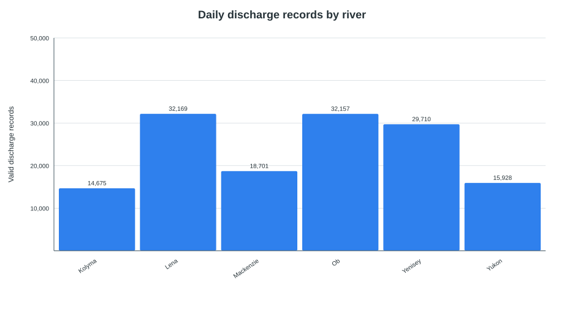

### Figure 2. Annual mean discharge time series

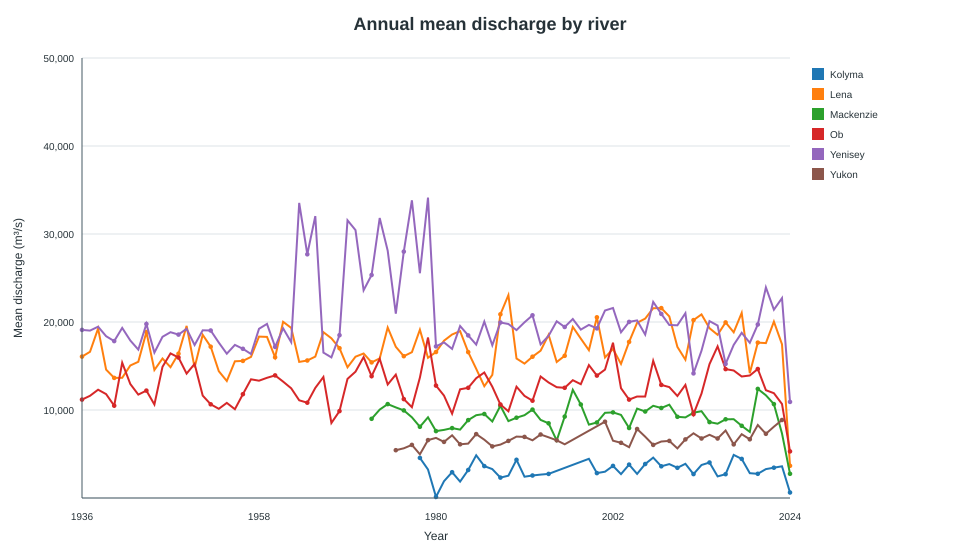

### Figure 3. Mean monthly discharge climatology

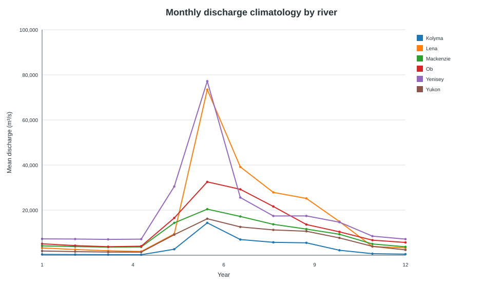

### Figure 4. ArcticGRO sample coverage by river

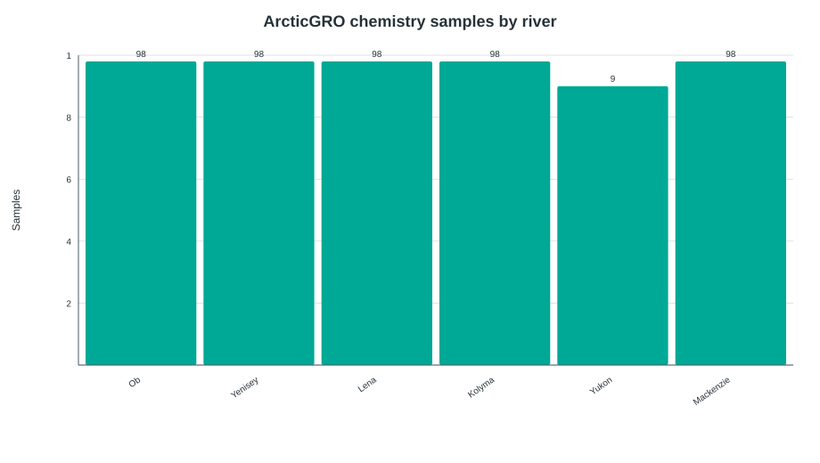

### Figure 5. DOC-discharge relationship

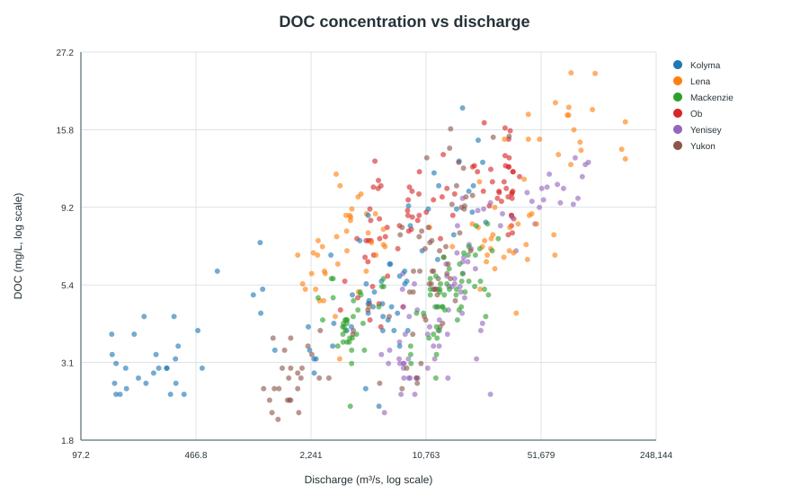

### Figure 6. HydroATLAS upstream basin area

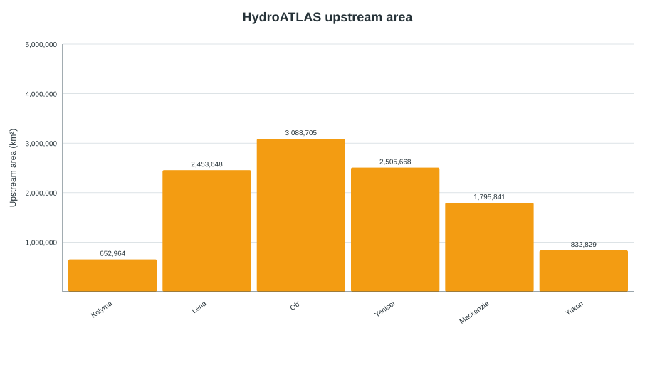

### Figure 7. MOREPOC geographic coverage

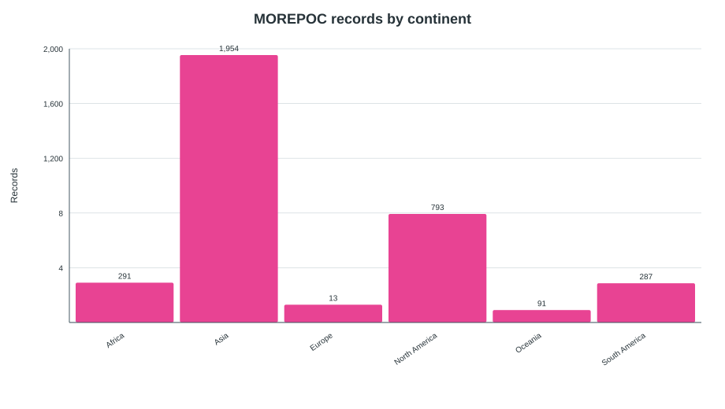

### Figure 8. MOREPOC POC versus SPM

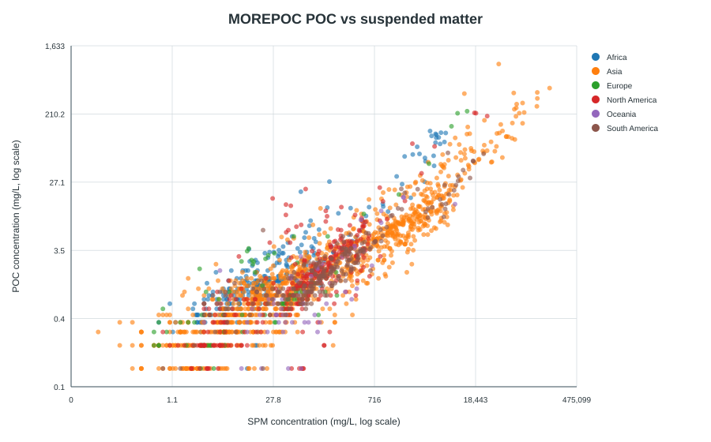

### Figure 9. REAL reach-width distribution

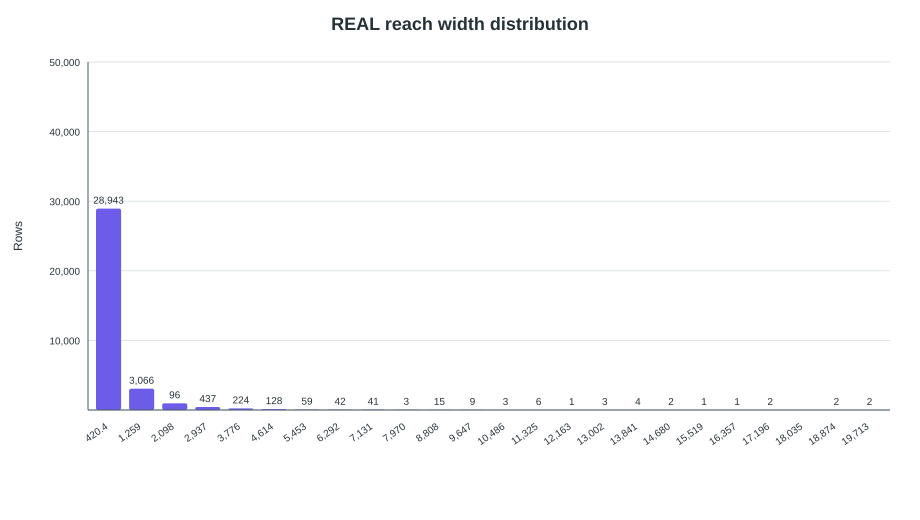

### Figure 10. REAL erosion rate versus width

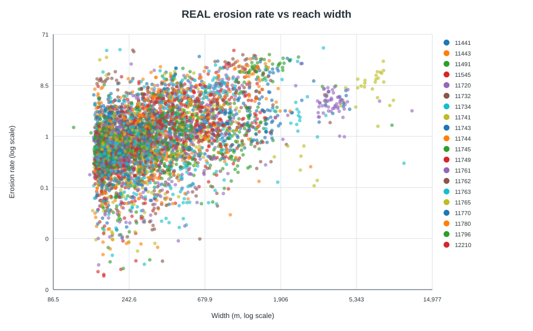

### Figure 11. Bankfull width versus discharge

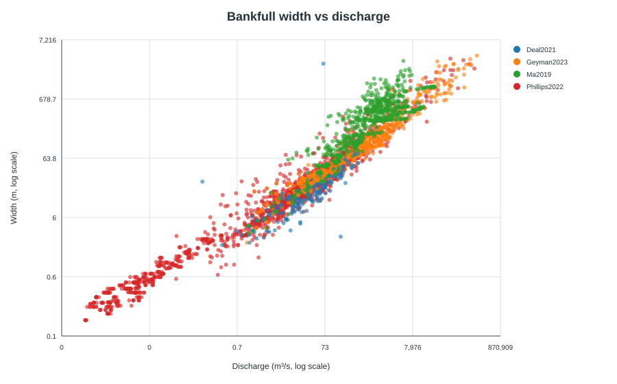

## Reproducibility notes

- The workflow uses only the Python standard library and directly parses CSV/XLSX inputs.
- SVG figures are written without external plotting libraries, which avoids package-download requirements in offline or restricted environments.
- The HydroATLAS PDF is cataloged as a reference document and is not numerically parsed by this run.
